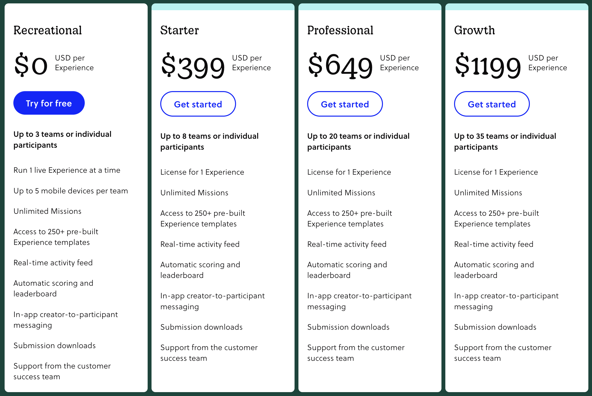
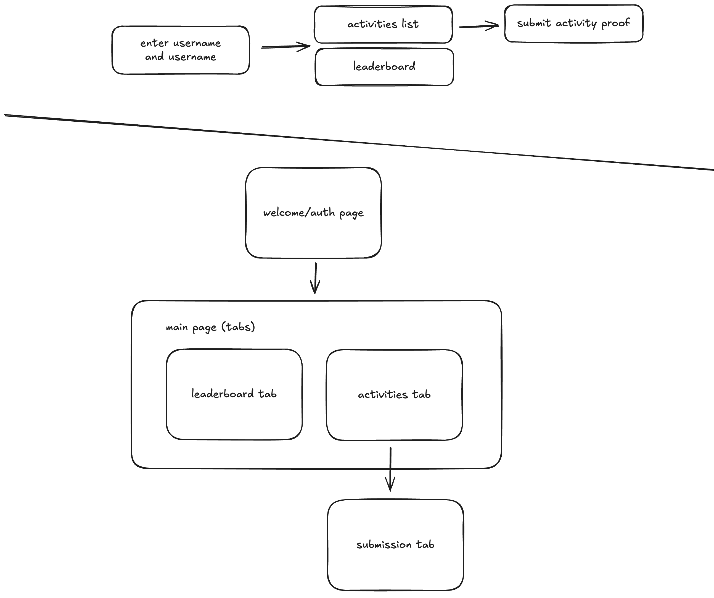

import Figure from "../../components/Figure.astro";
export const components = { img: Figure };

## Context

These past few months have included some very big changes in my life, one of
which, was starting my first year at university. One pretty significant
decision I had to make was which clubs to join (or apply to) that I would
enjoy, spend time on, meet cool people, and learn from.

Out of the clubs I applied for positions at, one role that really interested me
was in a committee that would organize the inaugural hackathon hosted by the
[UBC Science Undergraduate Society](https://www.susubc.ca/), and I was luckily
accepted to be a part of the team. The first few weeks was mostly non-technical
work like planning activities during the hackathon and reaching out to clubs,
sponsors, and companies. It was quite a new experience seeing how structured
the meetings were, how delegation of tasks happened, and also how much
networking is needed to put together a large event like this where you need to
know people from other clubs, organizations, and companies.

During one meeting, when brainstorming for activities during the hackathon, I
remembered back in high school when a teacher used an app called
[Goosechase](https://goosechase.com/) during a field trip to host a sort of
digital scavenger hunt. This would be perfect for our hackathon where we don't
really want to spend lots of time and resources setting up physical items for
people to find, but just give participants a list of activities or challenges
to do. Plus, this would encourage people to participate in the existing
activities we have planned, and not just spend the entire weekend coding.

So, I started coming up with ideas for challenges and activities, and I started
creating an experience in Goosechase... until I looked at their pricing page:



For some reason, Goosechase has limits for the number of teams or individuals
that can participate, and the higher limits necessary for this hackathon
(150-200 people) are way over budget for this scavenger hunt idea. I shared
this news with the rest of the team, and while doing so, I took the opportunity
to say _"Hey, I can just make our own version of this app."_ And that leads us
to creating ~~Goosechase~~ [DuckHunt](https://github.com/nycrat/duck-hunt/).

## Choosing the stack

The first decision I had to make before starting the development of this app is
what tech stack I would be using. While the user experience would probably be
better as a mobile application, we don't really want participants to have to
install an app to participate. Also, the process of getting an application onto
the Apple app store or Google play store requires money which kind of defeats
the entire point of this endeavour. So, I decided on a web application. I also
had two requirements in my head when choosing the specific languages and
frameworks to build this app.

1. It needs to allow for quick development; I don't want to work on this
   project for a long time, especially as finals are coming up. I've had the
   experience of burning out and not finishing a project too often, and need
   this project to get done quick.
2. This should be an experience to learn something new; I've worked on too many
   Next.js projects recently and my mind tells me to learn something new. I
   don't just want to push out another web app, I want to improve myself as
   a developer.

### Frontend choices

The three options I considered using were **Solid, Svelte, and Astro** (I also
briefly considered using vanilla javascript but for obvious reasons I decided
against that). After learning more about Astro, I decided it was better for a
content-heavy mainly static website (I ended up making this blog site with
Astro instead), so I ruled it out. And for Svelte, the main reason I considered
it was because of the [UBC CSSS](https://ubccsss.org/) and [Competitive
Programming Club](https://icpc.cs.ubc.ca/) websites made by a fellow UBC
student by the name of [polarity](https://github.com/polarr/). It seems like a
good frontend framework that I would like to learn at some point. However, I
chose Solid mainly because I already had some experience with it, but I would
still like to create another project to get more experience with it. It also
seemed more appropriate for this simple interactive web app. However, I feel
that Svelte would have been a fine option, and I hope to do some development
with Svelte for another project later on.

### Backend choices

For the server, I could have honestly chosen anything because of the simple
nature of this project, so I decided that this could be a good opportunity to
learn a completely new library/framework/language. I was thinking of Actix-web
for Rust since I've only used that framework for WebSockets when making [Duck
Simulator](https://github.com/nycrat/duck-simulator/), maybe Flask for Python,
Ruby on Rails, even just Express.js to keep it simple. But in the end,I decided
on using Golang and the `net/http` package in the Golang standard library. Now
although I have [tried learning Golang](https://youtu.be/J8VtJxtJbwc) a while
ago, I didn't end up building any projects with it, so I never learned it that
well. So, this was the perfect opportunity to do some project-based learning
for Golang.

Another choice for the backend I needed to make was which database to use. I
honestly didn't think too much about this. I just used PostgreSQL because I
was pretty familiar with it but still wanted to get more familiar, the same
reason I chose Solid for the frontend.

## UI/UX

For this project, I wanted a minimal design for the user experience because of
the limited scope of what the app needs to do. However, I didn't necessarily
need a minimal design for the user interface; given that the hackathon already
has a theme and designs for the main website, I wanted to just focus on
implementing the basic UX while leaving most of the UI design for later.

After watching a [video about UI/UX
design](https://www.youtube.com/watch?v=wIuVvCuiJhU), I started working on a
rough design of the user flow and wireframe for the web app. While the user
flow diagram seems normal enough, I didn't fully draw out the wireframes, so it
just ended up being a list of pages/routes I needed for the app. Although I
wanted some more concrete designs, I just ended up using this simple document
as the initial design for the application and started working on coding the
frontend.



## Frontend

For the frontend, I just started with importing some fonts I found online, and
getting the different page routes working. I was reminded of how similar the
scopes of Solid and React are when working on this, having to use a client-side
router instead of the file-based routing that is possible with more complete
web frameworks like Next.js.

```jsx
/* Client-side router for Solid */
<Router>
  <Route path="/" component={Welcome} />
  <Route path="/leaderboard" component={Leaderboard} />
  <Route path="/activities" component={Activities} />
  <Route path="/activities/:title" component={SubmissionPage} />
  <Route path="/admin/participants" component={ParticipantDashboard} />
  <Route path="/admin/participants/:id" component={ParticipantInfo} />
  <Route path="/admin/activities" component={ActivitiesDashboard} />
  <Route path="/admin/activities/:title" component={ActivityInfo} />
  <Route path="/admin/review/:title/:id" component={SubmissionReviewPage} />
  <Route path="*" component={NotFound} />
</Router>
```

Other than the client-side routing, another interesting development experience
I had was understanding the usage of Tailwind in a small application like this
one. Being able to quickly apply simple styles when designing the UI was very
useful, and by also implementing global styles, the UI is quite uniform like
you would expect with a component library.


Another aspect of Tailwind that I learned to appreciate by working on this
project was the mobile-first design that it encourages. The breakpoints for
Tailwind are by default targetting larger screens, so the default styles are
applied to mobile. Because the app would mostly be using by participants on
their phones, I applied styles with Tailwind with the mobile view as the
priority, which is also what I've started to do for other projects. I find it
much easier to design for a smaller screen first because its always possible
to use up more space on desktop, but not always possible to make elements
smaller for mobile.

## Backend

When starting development for the web server, I used a library (router) for Go
called [chi](https://github.com/go-chi/chi/) that integrates with `net/http`
instead of acting as an entirely different framework. From what I can tell, it
just provides some better development experience when dealing with registering
routes and handling middleware. But now that I reflect on my choice, I could
have just used the standard `net/http` library and the development process
would have been fine.

```go
package main

import "net/http"

// Basic http server written with Go
func main() {
   http.HandleFunc("/hello", func(w http.ResponseWriter, r *http.Request) {
      w.Write([]byte("helo there, this is from a server"))
   })
   http.ListenAndServe(":8000", nil)
}
```

After setting up a basic http server to re-learn the syntax of Golang and how
to define routes with the chi router, I made a few routes to serve some static
json data that the client would need to fetch from the server. Using the
`encoding/json` library, the route handler could serialize Go structs into JSON
to be parsed by the frontend.

(database integration)

(other stuff)

## Security risks

## Using middleware

## Refactoring backend

## Future improvements
